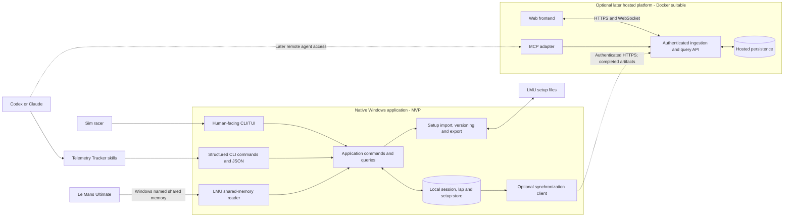

# Architecture Specification

## Purpose

This document defines the runtime and deployment boundaries for Telemetry Tracker. Use it to decide where a feature runs, which interface it should use, and whether it belongs in the local MVP or a later hosted phase.

The product is human-first. The development process is agent-first. Stable machine-readable operations support skills and automation, while the terminal experience remains designed for a sim racer.

## Non-Negotiable Boundary

The LMU-facing MVP is a native Windows application. It is not a Docker workload.

The local application must run on the same Windows machine and in a context that can:

- open LMU's Windows named shared-memory mapping, events, and locks;
- read and safely export LMU setup files;
- render the human-facing CLI/TUI;
- persist sessions, laps, traces, and setup revisions locally;
- work without Docker, Supabase, a hosted API, or network connectivity.

Do not move live LMU acquisition or setup-file application into a Linux or Windows container. A bind mount could expose files, but it does not provide the required host shared-memory objects and would make setup-file permissions and lifecycle unnecessarily fragile.

## Supported Runtime Boundary

LMU live integration is officially supported only on Windows 10/11. Windows is the authoritative runtime for LMU shared memory, setup-file access, plugins, hardware, and integration testing.

Linux is supported for development, builds, unit tests, documentation, and recorded/mock telemetry testing. The CLI must start gracefully on non-Windows systems and clearly report that live LMU functionality requires Windows.

Proton support is unofficial. Do not add abstractions, deployment paths, or MVP requirements solely to accommodate Proton.

## Architecture Diagram



Solid lines are MVP-local interactions. Dashed lines are optional later integrations.

## Native Windows Application

The native application owns the complete immediate driving loop:

```text
drive -> capture -> inspect -> compare -> ask -> propose setup -> confirm -> export -> drive again
```

### Responsibilities

- LMU shared-memory acquisition and prerequisite checks
- one local telemetry owner for any number of terminal views
- explicit tracking state and lap-boundary detection
- sampling, lap summaries, and detailed traces
- first-class sessions and setup associations
- local persistence, expected to start with an embedded store such as SQLite
- session/lap navigation and live telemetry in the TUI
- structured CLI operations used by skills
- setup snapshot, proposal, comparison, and explicitly confirmed export
- optional synchronization of durable completed artifacts in a later phase

### Local interfaces

- The TUI is the primary human interface.
- Slash commands are context-aware human actions inside the TUI.
- Structured CLI commands and JSON are the initial skill and automation boundary.
- Local IPC may allow multiple terminal clients to attach to one telemetry owner.
- HTTP is not required for the MVP's internal local workflow.

The human interface must not expose JSON, MCP, or agent implementation details unless the user explicitly asks for diagnostic output.

## Skills and MCP

Skills are the initial AI workflow. They use deterministic local CLI operations to inspect sessions, compare laps, and create versioned setup proposals.

MCP is a later adapter for agents. It may expose the same application commands and queries locally or through the hosted platform. MCP is not:

- the transport for continuous telemetry ingestion;
- the normal synchronization protocol between the native app and hosted service;
- the API consumed by the web frontend.

Native chat with a user-supplied AI provider key may be added later without removing skills.

## Optional Hosted Platform

The hosted platform is a separate later deployment concern and is suitable for Docker.

### Responsibilities

- authenticated ingestion of completed local artifacts
- synchronization and hosted persistence
- user accounts and authorization when required
- query APIs for remote history and analysis
- a web frontend and visualization services
- optional MCP tools for remote agent access
- server-side secrets, provider credentials, and Supabase access

The hosted platform must not be required for live driving, local history, local skills, or setup management.

### Transport rules

- Native application to hosted platform: authenticated HTTPS.
- Web frontend to hosted platform: HTTP APIs and WebSocket or server-sent events when live updates are justified.
- Agents to supported capabilities: structured local CLI initially; MCP later.
- Do not use MCP as application synchronization or frontend transport.

Upload completed or durable artifacts by default:

- session metadata;
- lap summaries;
- downsampled lap traces;
- setup snapshots or fingerprints;
- confirmed setup revision history;
- optional user-approved coaching history.

Do not stream every raw LMU packet to the hosted platform by default. Local telemetry and driving must remain unaffected by network or server failure.

## Docker Policy

The standalone native application has no Dockerfile or container tooling. Do not add Docker artifacts to the local application for development convenience or future speculation.

When the hosted phase becomes active:

- create an explicit server entry point or project;
- add a server-specific Dockerfile beside that deployable;
- keep the native application outside the server image;
- use mock or recorded data for containerized server tests that need telemetry-shaped input.

Docker belongs to a concrete hosted deployable, not to the current solution merely because a hosted platform is planned.

## Shared Application Core

Local and hosted adapters may reuse contracts and application logic, but deployment convenience must not blur their security or runtime boundaries.

- Keep commands and queries independent of TUI, CLI, MCP, and HTTP presentation.
- Keep Win32 and LMU file-system concerns inside the native integration boundary.
- Keep hosted database and service credentials out of the native client.
- Keep local operation functional when hosted configuration is absent.
- Add adapters only when their phase requires them; do not build speculative infrastructure.

## Feature Placement Test

Before implementing a feature, answer:

1. Does it require LMU shared memory, local setup files, or immediate driving feedback? It belongs in the native Windows application.
2. Does it support offline session, lap, comparison, setup, or skill workflows? It belongs in the local application core and local persistence.
3. Does it require accounts, cross-device synchronization, sharing, or a web frontend? Defer it to the hosted platform.
4. Is it an agent-facing adapter over mature commands and queries? Use structured CLI first and MCP later.
5. Is Docker being introduced for the local collector? Stop and redesign around the native boundary.
